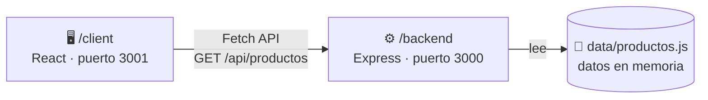

<div align="center">

# 🪑 Mueblería Hermanos Jota

### E-commerce full stack · React + Node.js/Express

Proyecto de curso de **Desarrollo Full Stack**: un catálogo de muebles con frontend en React y una API REST en Express.


[Descripción](#-descripción) •
[Arquitectura](#-arquitectura) •
[Instalación](#-instalación-y-ejecución) •
[Funcionalidades](#-funcionalidades-principales) •
[API](#-documentación-de-la-api) •
[Decisiones](#-decisiones-de-arquitectura)

</div>

---

## 📖 Descripción

**Mueblería Hermanos Jota** es un e-commerce desarrollado como proyecto de un curso de Desarrollo Full Stack. Es un **monorepo** que reúne en un mismo repositorio:

- 🖥️ **`/client`**: el frontend, desarrollado con React mediante Create React App.
- ⚙️ **`/backend`**: la API REST, desarrollada con Node.js + Express.

El frontend consume el catálogo de productos que expone la API y permite explorarlo, ver el detalle de cada producto, agregarlo al carrito y enviar un formulario de contacto.

---

## 👥 Integrantes

| Integrante |
|:-----------|
| Lautaro Iturrieta |
| Evelyn Noya Fraga |
| Matheo Dougan |

---

## 🧰 Tecnologías

<table>
  <tr>
    <th align="left">🖥️ Frontend (<code>/client</code>)</th>
    <th align="left">⚙️ Backend (<code>/backend</code>)</th>
  </tr>
  <tr>
    <td valign="top">
      <ul>
        <li>React 19</li>
        <li>Create React App / react-scripts</li>
        <li>JavaScript</li>
        <li>HTML</li>
        <li>CSS</li>
        <li>Fetch API</li>
      </ul>
    </td>
    <td valign="top">
      <ul>
        <li>Node.js</li>
        <li>Express 5</li>
        <li>CORS</li>
        <li>Nodemon</li>
        <li>ES Modules</li>
      </ul>
    </td>
  </tr>
</table>

---

## 🏗️ Arquitectura

El proyecto está organizado como un monorepo con dos aplicaciones independientes que se ejecutan en terminales separadas y se comunican por HTTP.



| Aplicación | Carpeta | Puerto | Rol |
|:-----------|:--------|:------:|:----|
| Frontend | `/client` | `3001` | Interfaz de usuario en React |
| Backend | `/backend` | `3000` | API REST del catálogo de productos |

---

## 📁 Estructura de carpetas

```text
/
├── client/                       # Frontend React (Create React App)
│   ├── public/
│   └── src/
│       ├── components/
│       │   ├── Navbar.js
│       │   ├── Footer.js
│       │   ├── ProductCard.js
│       │   ├── ProductList.js
│       │   ├── ProductDetail.js
│       │   └── ContactForm.js
│       ├── App.js
│       └── index.js
│
└── backend/                      # API REST (Node.js + Express)
    ├── data/
    │   └── productos.js          # Datos en memoria (catálogo de muebles)
    ├── middlewares/
    │   ├── logger.js             # Loguea método y URL de cada request
    │   ├── notFound.js           # Manejo de rutas inexistentes (404)
    │   └── errorHandler.js       # Manejo global de errores
    ├── routes/
    │   └── productos.routes.js   # Endpoints del catálogo de productos
    ├── .gitignore
    ├── index.js                  # Punto de entrada: configura Express y monta rutas
    ├── package.json
    └── README.md
```

---

## 🚀 Instalación y ejecución

> El frontend y el backend se ejecutan en **terminales separadas**. Para ver el catálogo en el cliente, ambos deben estar corriendo.

### Requisitos

- Node.js `>= 18`
- npm `>= 9`

### 1️⃣ Backend — puerto `3000`

En la **Terminal 1**:

```bash
cd backend
npm install
npm run dev
```

También puede ejecutarse con `npm start`.

Para cambiar el puerto, creá un archivo `.env` dentro de `/backend`:

```env
PORT=4000
```

### 2️⃣ Frontend — puerto `3001`

En la **Terminal 2**:

```bash
cd client
npm install
npm start
```

---

## ✨ Funcionalidades principales

### 🖥️ Frontend

- 📦 Obtención del catálogo desde `GET /api/productos`.
- 🔄 Manejo de estados de **loading**, **error** y **success**.
- 🗂️ Renderizado de productos mediante `.map()` y `key`.
- 🔍 Vista de detalle de producto mediante **renderizado condicional**, sin React Router.
- 🛒 Estado del carrito administrado en `App.js`.
- 🔢 Contador del carrito enviado al `Navbar` mediante props.
- ➕ Agregar productos al carrito.
- 📝 Formulario de contacto controlado mediante `useState`.
- 📱 Diseño responsive.

**Componentes principales**

| Componente | Componente | Componente |
|:----------:|:----------:|:----------:|
| `Navbar` | `ProductList` | `ContactForm` |
| `Footer` | `ProductCard` | `ProductDetail` |

### ⚙️ Backend

- 🩺 Endpoint de verificación del estado de la API.
- 📃 Listado completo de productos y consulta por ID.
- 🚫 Respuesta HTTP 404 para productos inexistentes y para rutas no definidas.
- 🧾 Logging de método y URL de cada request.
- 🛡️ Manejo centralizado de errores.

---

## 📡 Documentación de la API

**URL base:** `http://localhost:3000`

| Método | Endpoint | Descripción |
|:------:|:---------|:------------|
| `GET` | `/` | Comprueba que la API funciona |
| `GET` | `/api/productos` | Devuelve todos los productos |
| `GET` | `/api/productos/:id` | Devuelve un producto por ID |

<details>
<summary><b><code>GET /</code></b> — Verificación de la API</summary>

<br>

```bash
curl http://localhost:3000/
```

**Respuesta `200`**

```json
{ "mensaje": "API Mueblería Jota funcionando" }
```

</details>

<details>
<summary><b><code>GET /api/productos</code></b> — Listado completo</summary>

<br>

```bash
curl http://localhost:3000/api/productos
```

**Respuesta `200`**

```json
[
  {
    "id": 1,
    "nombre": "Sofá Patagonia",
    "categoria": "Living",
    "precio": 185000,
    "destacado": true
  }
]
```

> El ejemplo está abreviado: cada producto incluye además otros campos definidos en `backend/data/productos.js`.

</details>

<details>
<summary><b><code>GET /api/productos/:id</code></b> — Producto por ID</summary>

<br>

```bash
# Producto existente
curl http://localhost:3000/api/productos/1

# Producto inexistente
curl http://localhost:3000/api/productos/9999
```

**Respuesta `200` (encontrado)**

```json
{
  "id": 1,
  "nombre": "Sofá Patagonia",
  "categoria": "Living",
  "precio": 185000
}
```

**Respuesta `404` (no encontrado)**

```json
{ "error": "Producto no encontrado" }
```

</details>

<details>
<summary><b>Ruta inexistente</b> — Cualquier path no definido</summary>

<br>

```bash
curl http://localhost:3000/ruta-que-no-existe
```

**Respuesta `404`**

```json
{ "error": "Ruta no encontrada" }
```

</details>

---

## 🧠 Decisiones de arquitectura

| Decisión | Detalle |
|:---------|:--------|
| **Monorepo** | `/client` y `/backend` conviven en un mismo repositorio como aplicaciones separadas, cada una con su propio `package.json`, instalación y puerto. |
| **Datos locales, sin base de datos** | Los productos se almacenan en `backend/data/productos.js`. No se utiliza base de datos. |
| **API con `express.Router`** | Las rutas del catálogo se definen en `routes/productos.routes.js` y se montan desde `index.js`. |
| **Middlewares dedicados** | Logging de método y URL, middleware 404 y middleware centralizado de errores, cada uno en su propio archivo dentro de `middlewares/`. |
| **`express.json()`** | La API incorpora el parseo de JSON como middleware. |
| **ES Modules** | El backend utiliza ES Modules. |
| **Estado del carrito en `App.js`** | El estado del carrito se administra en `App.js` y el contador se envía al `Navbar` mediante props. |
| **Detalle de producto sin router** | La vista de detalle se resuelve con renderizado condicional, sin React Router. |
| **Estados de la petición** | El frontend contempla los estados de loading, error y success al consumir `GET /api/productos`. |

---

## 📜 Scripts disponibles

### Frontend (`/client`)

| Comando | Descripción |
|:--------|:------------|
| `npm start` | Inicia el frontend en modo desarrollo (puerto `3001`) |
| `npm test` | Ejecuta los tests |
| `npm run build` | Genera el build de producción |

### Backend (`/backend`)

| Comando | Descripción |
|:--------|:------------|
| `npm run dev` | Modo desarrollo con Nodemon: reinicia al guardar (puerto `3000`) |
| `npm start` | Ejecuta el servidor directamente con Node |

---

<div align="center">

Proyecto desarrollado por **Lautaro Iturrieta**, **Evelyn Noya Fraga** y **Matheo Dougan**
como parte de un curso de Desarrollo Full Stack.

</div>
